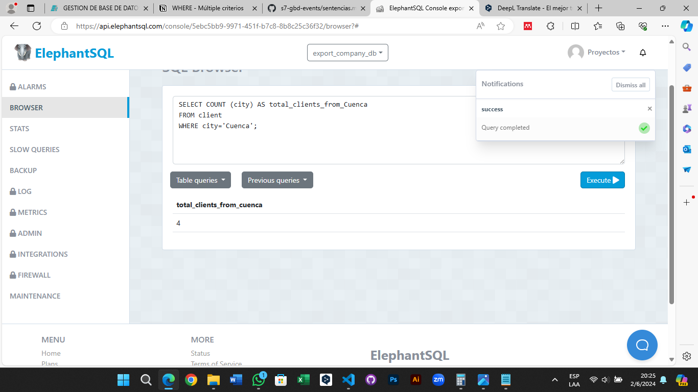

# Tarea TAS7 - Events
## 1. Contar el número de productos de una categoría específica.
  - Sentencia:
  ```
  SELECT COUNT (category) AS total_electronic_products
  FROM product
  WHERE category='Electronics';
  ```
  - Captura:


## 2. Contar el número de clientes en una ciudad específica.
  - Sentencia:
  ```
  SELECT COUNT (city) AS total_clients_from_Cuenca
  FROM client
  WHERE city='Cuenca';
  ```
  - Captura:



## 3. Contar el número de productos cuyo precio está dentro de un rango específico.
  - Sentencia:
  ```
  SELECT COUNT (price) AS total_electronic_products
  FROM product
  WHERE price >100.00 AND price <1000.00;
  ```
  - Captura:


## 4. Seleccionar clientes que viven en una ciudad específica y tienen un tipo de cliente específico.
  - Sentencia:
  ```
  SELECT COUNT (price) AS total_electronic_products
  FROM product
  WHERE price >100.00 AND price <1000.00;
  ```
  - Captura:

