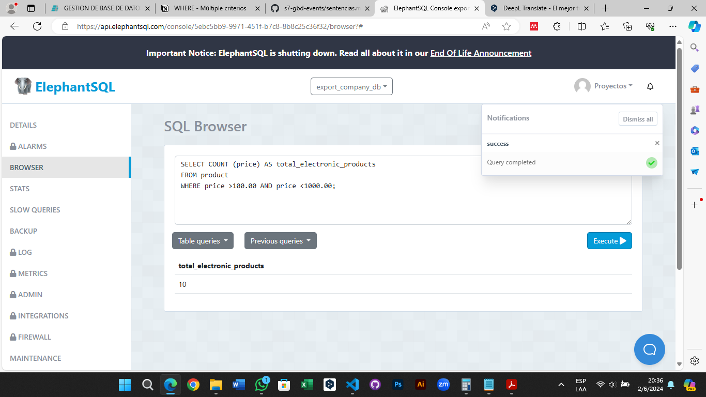

# Tarea TAS7 - Events
## 1. Contar el número de productos de una categoría específica.
  - Sentencia:
  ```
  SELECT COUNT (category) AS total_electronic_products
  FROM product
  WHERE category='Electronics';
  ```
  - Captura:


## 2. Contar el número de clientes en una ciudad específica.
  - Sentencia:
  ```
  SELECT COUNT (city) AS total_clients_from_Cuenca
  FROM client
  WHERE city='Cuenca';
  ```
  - Captura:


## 3. Contar el número de productos cuyo precio está dentro de un rango específico.
  - Sentencia:
  ```
  SELECT COUNT (price) AS total_electronic_products
  FROM product
  WHERE price >100.00 AND price <1000.00;
  ```
  - Captura:



## 4. Seleccionar clientes que viven en una ciudad específica y tienen un tipo de cliente específico.
  - Sentencia:
  ```
  SELECT * FROM client
  WHERE city='Guayaquil' AND 
  type_of_client='Corporate';
  ```
  - Captura:


## 5. Seleccionar productos que pertenecen a una categoría específica y cuyo precio está por encima de un valor específico.
  - Sentencia:
  ```
  SELECT * FROM product
  WHERE category='Accessories' AND 
  price>200.00;
  ```
  - Captura:


## 6. Seleccionar productos que fueron producidos en un año específico y en un país de origen específico.
  - Sentencia:
  ```
  SELECT * FROM product
  WHERE year_of_production='2023' AND 
  country_of_origin='China';
  ```
  - Captura:


## 7. Seleccionar clientes cuyo nombre completo comience con 'J'.
  - Sentencia:
  ```
  SELECT * FROM client
  WHERE fullname LIKE 'J%';
  ```
  - Captura:


## 8. Seleccionar clientes cuya ciudad contenga la letra 'a'.
  - Sentencia:
  ```
  SELECT * FROM client
  WHERE city LIKE '%a%';
  ```
  - Captura:

